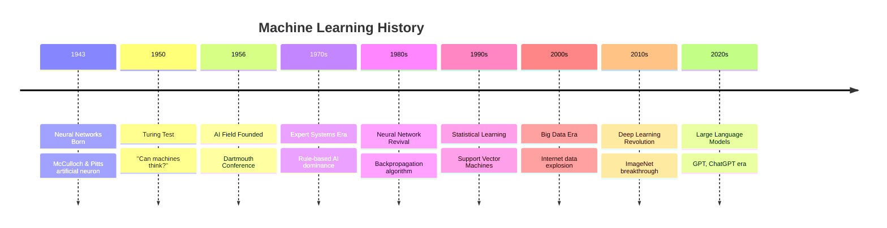

# 🧠 Machine Learning Unit 1: Complete Study Guide
*Introduction to Machine Learning*

## 📋 TL;DR - Quick Overview

**What You'll Master:**
- What machine learning actually is (spoiler: it's not magic!)
- Three main types: supervised, unsupervised, reinforcement learning
- Why ML matters in our daily lives
- Key ethical considerations and interpretability

**Study Time:** ~8 hours | **Key Focus:** Building foundational understanding

---

## 🎯 Learning Goals Checkpoint

By the end of this unit, you'll be able to:
- ✅ Explain ML as a scientific domain
- ✅ Distinguish different ML paradigms 
- ✅ Describe important ML history moments
- ✅ Name key aspects like security and privacy
- ✅ Distinguish interpretability techniques

---

## 1️⃣ What is Machine Learning?

### 🔍 The Simple Definition

> **Machine Learning = Teaching computers to learn patterns from data without explicit programming**

Think of it like this:
- **Traditional Programming:** You write specific rules → Computer follows them
- **Machine Learning:** You show examples → Computer learns the patterns

### 🎯 Real-World Analogy: Teaching a Friend to Recognize Dogs

| Traditional Method | ML Method |
|-------------------|-----------|
| Give detailed rules: "Dogs have 4 legs, fur, bark..." | Show 1000 photos labeled "dog" or "not dog" |
| Friend memorizes rules | Friend learns patterns automatically |
| Struggles with unusual dogs | Adapts to new dog breeds |

### 💡 Key Insight
ML gives computers the ability to **improve performance** on a task through **experience** (data).

---

## 2️⃣ The Three ML Paradigms

### 🏷️ Supervised Learning
**What it is:** Learning with a teacher who provides correct answers

**Visual Example:**
```
Input: Email text
Output: Spam or Not Spam
Training: Show 10,000 emails already labeled as spam/not spam
```

**Real-world examples:**
- 📧 Email spam detection
- 🏥 Medical diagnosis from symptoms
- 💰 Credit approval decisions

**Two types:**
- **Classification:** Predicting categories (spam/not spam)
- **Regression:** Predicting numbers (house prices)

### 🔍 Unsupervised Learning
**What it is:** Finding hidden patterns without any correct answers

**Visual Example:**
```
Input: Customer purchase data
Output: Customer groups discovered
No labels: Algorithm finds patterns on its own
```

**Real-world examples:**
- 🛒 Customer segmentation for marketing
- 🔍 Detecting unusual behavior in networks
- 📊 Data compression and visualization

**Key Types:**
- **Clustering:** Grouping similar things together
- **Association:** Finding relationships ("people who buy X also buy Y")

### 🎮 Reinforcement Learning
**What it is:** Learning through trial and error with rewards/penalties

**Game Analogy:**
```
Agent (Player) ↔ Environment (Game)
Actions → Rewards/Penalties → Learning
```

**Real-world examples:**
- 🤖 Game-playing AI (AlphaGo, chess)
- 🚗 Autonomous vehicles
- 💊 Drug discovery optimization

---

## 3️⃣ Machine Learning vs Data Mining

### 🔄 The Key Difference

| Aspect | Machine Learning | Data Mining |
|--------|------------------|-------------|
| **Goal** | Build predictive models | Extract knowledge from large datasets |
| **Focus** | Algorithm performance | Pattern discovery |
| **Relationship** | Creates the methods | Uses ML methods on big data |

**Simple analogy:** 
- **ML** = Developing fishing techniques
- **Data Mining** = Using those techniques to fish in a huge lake

---

## 4️⃣ ML Throughout History

### 📅 Key Timeline Moments



### 💡 Why History Matters
Understanding ML's journey helps you:
- Recognize recurring patterns in AI development
- Avoid repeating past mistakes
- Appreciate current capabilities and limitations

---

## 5️⃣ Essential ML Topics

### 🖥️ High-Performance Computing

**Why it matters:**
- ML algorithms need serious computational power
- Different processors excel at different tasks

**Key Hardware:**
- **CPUs:** General processing, good for traditional algorithms
- **GPUs:** Parallel processing, excellent for neural networks
- **TPUs:** Google's specialized ML chips

### 🔒 Data Privacy & Security

**Critical Issues:**
1. **Personal Data Protection**
   - GDPR compliance
   - Anonymization techniques
   - Consent management

2. **Model Security**
   - Adversarial attacks
   - Model stealing
   - Privacy-preserving ML

**Attack Types (Exercise 1.10 reference):**
- Model inversion attack
- Membership inference attack
- De-anonymization
- Model classification attack

### 🤝 Interoperability & Trust

**Building Trustworthy ML:**
- **Testing:** Rigorous validation procedures
- **Explainability:** Understanding model decisions
- **Reproducibility:** Consistent results across runs
- **Fairness:** Avoiding discriminatory outcomes

### 📊 Data Science Methodology (CRISP-DM)

**The 6-Phase Process:**

```
1. Business Understanding ← Start Here
   ↓
2. Data Understanding
   ↓
3. Data Preparation ← Most Time-Consuming
   ↓
4. Modeling
   ↓
5. Evaluation
   ↓
6. Deployment → Real-World Impact
```

**Phase Breakdown:**
- **Business Understanding:** What problem are we solving?
- **Data Understanding:** What data do we have?
- **Data Preparation:** Clean and prepare data (often 80% of work!)
- **Modeling:** Build and tune algorithms
- **Evaluation:** Test model performance
- **Deployment:** Put model into production

---

## 6️⃣ Interpretability in ML

### 🔍 Why Interpretability Matters

**The Challenge:**
Modern ML models are increasingly powerful but less interpretable
- Simple models: Easy to understand, limited power
- Complex models: High performance, "black box" behavior

### 🏥 Real-World Example: POTTER Surgical Risk Calculator

**What it does:** Predicts surgery risks using interpretable decision trees

**Why it works:**
- Doctors can see the reasoning
- Transparent decision-making process
- Builds trust in medical settings

### 📊 Evaluation Types

| Evaluation Type | Description | Human Involvement |
|----------------|-------------|-------------------|
| **Application-grounded** | Real users in real applications | ✅ Yes - Domain experts |
| **Functionality-grounded** | Formal quality definitions | ❌ No - Automated metrics |

---

## 7️⃣ Practical Applications

### 🔐 Cybersecurity Examples
1. **Impact Assessment:** Predicting cyber-incident consequences
2. **Street Surveillance:** Pattern recognition for safety
3. **Strategy Determination:** AI-powered security decisions

### 🏥 Healthcare Applications
- Medical image analysis
- Drug discovery
- Treatment personalization
- Epidemic modeling

### 🚗 Transportation
- Route optimization
- Autonomous vehicles
- Traffic flow management
- Predictive maintenance

---

## 8️⃣ Study Tips & Strategies

### 🧠 For ADHD-Friendly Learning

**Break it down:**
- Study in 25-minute focused sessions
- Use visual aids and diagrams
- Create mind maps for connections
- Practice with real examples

**Active engagement:**
- Try simple coding examples
- Draw concept maps
- Explain concepts to others
- Find ML in your daily life

### 📚 Recommended Resources

**Videos to Watch:**
- History of ML timeline video
- CRISP-DM methodology explanation
- Privacy in ML examples

**Hands-on Activities:**
- Explore simple datasets
- Try online ML tools
- Read about ML in news

---

## 🎯 Key Takeaways

### ✅ Essential Concepts Mastered
1. **ML Definition:** Computers learning from data without explicit programming
2. **Three Paradigms:** Supervised (with labels), Unsupervised (find patterns), Reinforcement (trial and error)
3. **Historical Context:** From 1940s neural networks to modern deep learning
4. **Practical Considerations:** Privacy, security, interpretability, and methodology

### 🔄 Connection to Future Units
- Unit 2: Data Science Methodology (deeper dive into CRISP-DM)
- Unit 3-4: Supervised learning algorithms in detail
- Unit 8: Unsupervised learning (clustering)
- Unit 10: Reinforcement learning applications

### 💡 Final Thought
Machine learning isn't just about algorithms—it's about **solving real-world problems** while considering **ethical implications** and **human needs**. The field combines technical skills with critical thinking about societal impact.

---

## 🔧 Quick Reference Card

| Term | Simple Definition | Example |
|------|------------------|---------|
| **Algorithm** | Set of rules for solving problems | Recipe for chocolate cake |
| **Model** | Trained algorithm ready to make predictions | Chef who learned the recipe |
| **Training Data** | Examples used to teach the algorithm | Practice attempts at making cake |
| **Feature** | Individual measurable property | Ingredient (flour, sugar, etc.) |
| **Label** | Correct answer in supervised learning | "Good cake" or "Bad cake" rating |

**Remember:** Every expert was once a beginner. Take it one concept at a time! 🌟
