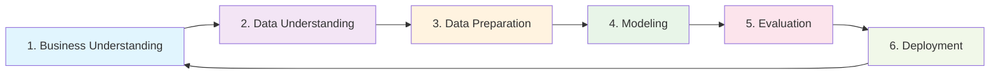

# 🔬 Machine Learning Unit 2: Data Science Methodology
*From Raw Data to Actionable Insights*

## 📋 TL;DR - Quick Overview

**What You'll Master:**
- CRISP-DM methodology (the roadmap for ML projects)
- Data preparation techniques (the foundation of success)
- Dimensionality reduction (making big data manageable)
- Overfitting vs. underfitting (the Goldilocks problem)

**Study Time:** ~8 hours | **Key Focus:** Building systematic approach to ML projects

---

## 🎯 Learning Goals Checkpoint

By the end of this unit, you'll be able to:
- ✅ Explain CRISP-DM methodology phases
- ✅ Apply data preparation techniques
- ✅ Distinguish dimensionality reduction methods
- ✅ Explain overfitting/underfitting concepts

---

## 1️⃣ CRISP-DM: Your ML Project GPS

### 🗺️ The Big Picture

**CRISP-DM** = **CR**oss-**I**ndustry **S**tandard **P**rocess for **D**ata **M**ining

Think of it as your GPS for ML projects - it tells you where you are, where you're going, and how to get there!

### 📊 The 6-Phase Journey



### 🔍 Phase-by-Phase Breakdown

#### 🎯 Phase 1: Business Understanding
**What it is:** Define the problem you're solving

**Key Questions:**
- What business problem are we solving?
- What does success look like?
- What constraints do we have?

**Real Example:**
```
Problem: "Our customers are leaving"
→ Business Goal: Reduce customer churn by 15%
→ ML Goal: Predict which customers will leave next month
```

#### 📊 Phase 2: Data Understanding
**What it is:** Explore and get familiar with your data

**Activities:**
- Collect initial data
- Describe the data
- Explore the data
- Verify data quality

**Data Detective Questions:**
- How much data do we have?
- What does it look like?
- Are there missing values?
- What patterns do we see?

#### 🛠️ Phase 3: Data Preparation
**What it is:** Clean and prepare data for modeling

**⚠️ Reality Check:** This phase takes **60-80%** of your time!

**Key Activities:**
- Data cleaning
- Feature engineering
- Data transformation
- Missing value handling

#### 🤖 Phase 4: Modeling
**What it is:** Build and tune your ML models

**Activities:**
- Select modeling technique
- Generate test design
- Build model
- Assess model

#### 📈 Phase 5: Evaluation
**What it is:** Check if your model meets business objectives

**Key Questions:**
- Does the model solve the business problem?
- Are the results reliable?
- Should we deploy this model?

#### 🚀 Phase 6: Deployment
**What it is:** Put your model into production

**Activities:**
- Plan deployment
- Monitor performance
- Maintain model
- Review project

---

## 2️⃣ Data Preparation: The Foundation of Success

### 🏗️ Why Data Preparation Matters

**Analogy:** Building a house
- **Bad foundation (messy data)** → House collapses (model fails)
- **Good foundation (clean data)** → House stands strong (model succeeds)

### 🔧 Essential Data Preparation Steps

| Step | What You Do | Why It Matters |
|------|-------------|----------------|
| **1. Data Collection** | Gather relevant data sources | No data = No model |
| **2. Data Inspection** | Check data quality and structure | Understand what you're working with |
| **3. Data Cleaning** | Remove duplicates, fix errors | Garbage in = Garbage out |
| **4. Missing Value Handling** | Deal with incomplete data | Missing data can break models |
| **5. Feature Engineering** | Create new meaningful features | Better features = Better models |
| **6. Data Transformation** | Scale, normalize, encode data | Prepare data for algorithms |

### 🧹 Data Cleaning Checklist

**✅ Remove Duplicates**
```python
# Before: 1000 rows with 50 duplicates
# After: 950 unique rows
```

**✅ Handle Missing Values**
```python
# Options:
# 1. Delete rows with missing values
# 2. Fill with mean/median/mode
# 3. Use advanced imputation techniques
```

**✅ Fix Data Types**
```python
# Before: Age stored as text "25"
# After: Age stored as number 25
```

**✅ Handle Outliers**
```python
# Decide: Remove, cap, or keep outliers
# Context matters!
```

---

## 3️⃣ Dimensionality Reduction: Taming the Data Beast

### 🎯 The Problem: Curse of Dimensionality

**What it is:** When you have too many features (dimensions), strange things happen

**Analogy:** Finding your friend in a crowd
- **1D (line):** Easy to find them
- **2D (field):** Still manageable
- **3D (building):** Getting harder
- **1000D (hyperspace):** Nearly impossible!

### 📊 Visual Understanding

```
High Dimensions = Problems:
🔍 Data becomes sparse
🐌 Algorithms slow down
📈 Overfitting increases
🎯 Harder to visualize
```

### 🛠️ Two Main Approaches

#### 📐 PCA (Principal Component Analysis)
**What it does:** Finds the most important directions in your data

**Kitchen Analogy:**
- You have 20 ingredients
- PCA finds the 5 most important ones
- You keep 80% of the flavor with 25% of the ingredients

**How it works:**
1. Find direction of maximum variance
2. Find second direction (perpendicular to first)
3. Continue until you have enough components
4. Keep top components, discard the rest

#### 🎯 LDA (Linear Discriminant Analysis)
**What it does:** Finds directions that best separate different classes

**Sports Team Analogy:**
- PCA: "What positions show most variation in player stats?"
- LDA: "What positions best separate good vs. bad teams?"

**Key Difference:**
- **PCA:** Unsupervised (doesn't use labels)
- **LDA:** Supervised (uses class labels)

### 📊 Comparison Table

| Aspect | PCA | LDA |
|--------|-----|-----|
| **Goal** | Preserve variance | Maximize class separation |
| **Supervision** | Unsupervised | Supervised |
| **Use When** | Data visualization, compression | Classification preprocessing |
| **Output** | Principal components | Linear discriminants |

---

## 4️⃣ The Goldilocks Problem: Overfitting vs. Underfitting

### 🎯 The Core Concept

**Analogy:** Learning to drive
- **Underfitting:** You only learned to go straight (too simple)
- **Just Right:** You can handle most driving situations
- **Overfitting:** You memorized every pothole on your practice route (too specific)

### 📊 Visual Understanding

```
Model Complexity ←→ Performance

Simple Model (Underfitting):
📉 Poor on training data
📉 Poor on test data
❌ High bias, low variance

Complex Model (Overfitting):
📈 Great on training data
📉 Poor on test data
❌ Low bias, high variance

Just Right Model:
📈 Good on training data
📈 Good on test data
✅ Balanced bias-variance
```

### 🔍 How to Detect

| Problem | Training Performance | Test Performance | What to Do |
|---------|---------------------|------------------|------------|
| **Underfitting** | Poor | Poor | Add complexity |
| **Just Right** | Good | Good | You're done! |
| **Overfitting** | Excellent | Poor | Reduce complexity |

### 🛠️ Solutions Toolkit

**For Underfitting:**
- Add more features
- Use more complex model
- Reduce regularization
- Train longer

**For Overfitting:**
- Get more training data
- Use simpler model
- Add regularization
- Early stopping

---

## 5️⃣ Hands-On Data Analysis

### 🔬 Your Data Analysis Recipe

**Step 1: Import Essential Libraries**
```python
import pandas as pd
import numpy as np
import matplotlib.pyplot as plt
import seaborn as sns
```

**Step 2: Load and Inspect Data**
```python
# Load data
df = pd.read_csv('your_data.csv')

# Quick overview
print(f"Shape: {df.shape}")
print(f"Columns: {df.columns.tolist()}")
print(f"Data types:\n{df.dtypes}")
```

**Step 3: Data Quality Check**
```python
# Missing values
print(f"Missing values:\n{df.isnull().sum()}")

# Duplicates
print(f"Duplicates: {df.duplicated().sum()}")

# Basic statistics
print(f"Statistics:\n{df.describe()}")
```

### 📊 Essential Analysis Steps

| Analysis Type | Code Example | What It Reveals |
|---------------|--------------|-----------------|
| **Shape** | `df.shape` | Number of rows and columns |
| **Missing Values** | `df.isnull().sum()` | Data quality issues |
| **Data Types** | `df.dtypes` | What kind of data you have |
| **Statistics** | `df.describe()` | Distribution of numeric data |
| **Correlations** | `df.corr()` | Relationships between variables |

---

## 6️⃣ Eigenvalues & Eigenvectors: The Math Behind PCA

### 🎯 Simple Explanation

**Analogy:** Finding the "grain" in wood
- **Eigenvectors:** Direction of the grain
- **Eigenvalues:** How pronounced the grain is

### 🔢 Practice Example

**Given Matrix:**
```
[-5  2]
[-7  4]
```

**Step-by-step solution:**
1. Find characteristic equation: det(A - λI) = 0
2. Solve for eigenvalues (λ)
3. For each λ, solve (A - λI)v = 0 for eigenvectors

**💡 Pro Tip:** Use numpy for verification!
```python
import numpy as np
A = np.array([[-5, 2], [-7, 4]])
eigenvalues, eigenvectors = np.linalg.eig(A)
```

---

## 7️⃣ Study Strategies & Tips

### 🧠 ADHD-Friendly Learning Approach

**🍅 Pomodoro Technique:**
- 25 minutes focused study
- 5-minute break
- Repeat 4 times
- Longer break

**🎯 Active Learning:**
- Explain concepts out loud
- Draw diagrams and flowcharts
- Code simple examples
- Teach someone else

**📝 Note-Taking Strategy:**
- Use mind maps for connections
- Color-code different concepts
- Create visual summaries
- Write your own analogies

### 🔄 Practice Exercises

**Exercise 1: CRISP-DM Application**
Pick a problem from your daily life and map it to CRISP-DM phases:
- Example: "Why do I always run out of groceries?"

**Exercise 2: Data Preparation**
Download a messy dataset and clean it:
- Handle missing values
- Remove duplicates
- Fix data types
- Create summary statistics

**Exercise 3: Dimensionality Reduction**
- Apply PCA to a high-dimensional dataset
- Visualize the results
- Interpret the components

---

## 8️⃣ Real-World Applications

### 🏥 Healthcare Example: Patient Risk Assessment

**Business Understanding:**
- Problem: Predict patient readmission risk
- Goal: Reduce readmissions by 20%

**Data Understanding:**
- Patient demographics
- Medical history
- Treatment records
- 50+ features available

**Data Preparation:**
- Clean missing values in medical records
- Encode categorical variables
- Normalize numeric features
- Create composite risk scores

**Modeling:**
- Try multiple algorithms
- Use cross-validation
- Feature selection with PCA/LDA

### 🛒 E-commerce Example: Customer Segmentation

**Business Understanding:**
- Problem: Improve marketing effectiveness
- Goal: Increase conversion by 15%

**Data Preparation:**
- Purchase history
- Browsing behavior
- Demographics
- Handle missing purchase data

**Dimensionality Reduction:**
- 100+ features → 10 key components
- Visualize customer segments
- Interpret business meaning

---

## 9️⃣ Common Pitfalls & How to Avoid Them

### ⚠️ Data Preparation Mistakes

| Mistake | Why It's Bad | How to Fix |
|---------|--------------|------------|
| **Skipping EDA** | Miss important patterns | Always explore first |
| **Ignoring missing values** | Models break | Handle systematically |
| **Not checking distributions** | Assumptions violated | Plot histograms |
| **Forgetting to scale** | Some algorithms fail | Standardize features |

### 🎯 Model Building Mistakes

| Mistake | Consequence | Solution |
|---------|-------------|---------|
| **Data leakage** | Overly optimistic results | Careful feature engineering |
| **Wrong evaluation metric** | Misleading performance | Choose appropriate metrics |
| **No validation set** | Can't detect overfitting | Always split data properly |
| **Ignoring business context** | Useless model | Keep business goals in mind |

---

## 🎯 Key Takeaways

### ✅ Essential Concepts Mastered

1. **CRISP-DM:** Your systematic approach to ML projects
2. **Data Preparation:** The foundation that determines success
3. **Dimensionality Reduction:** Making complex data manageable
4. **Overfitting/Underfitting:** The balance between simplicity and complexity

### 🔄 Connection to Other Units

- **Unit 1:** Applied the ML fundamentals
- **Unit 3-4:** Will use these data preparation techniques
- **Unit 5:** Statistical testing builds on evaluation concepts
- **Unit 6-7:** Advanced algorithms need good data preparation

### 💡 Final Wisdom

**Remember:** Great ML isn't about fancy algorithms—it's about understanding your data and following a systematic process. CRISP-DM gives you that structure!

---

## 🔧 Quick Reference Card

| Phase | Key Question | Time Investment |
|-------|--------------|-----------------|
| **Business Understanding** | What problem are we solving? | 10-15% |
| **Data Understanding** | What data do we have? | 10-15% |
| **Data Preparation** | How do we clean the data? | 60-80% |
| **Modeling** | Which algorithm works best? | 5-10% |
| **Evaluation** | Does it solve the problem? | 5-10% |
| **Deployment** | How do we use it? | 5-10% |

### 🎯 Data Quality Checklist
- [ ] Check for missing values
- [ ] Remove duplicates
- [ ] Fix data types
- [ ] Handle outliers
- [ ] Scale/normalize features
- [ ] Engineer new features
- [ ] Validate data quality

**Success Mantra:** "Garbage in, garbage out—but gold in, gold out!" ✨
